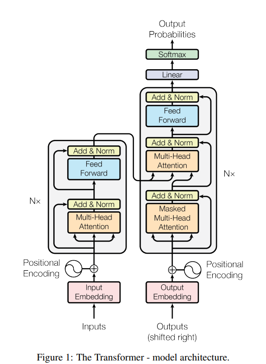

# Abstract

The dominant sequence transduction models are based on complex recurrent or convolutional neural networks that include an encoder and a decoder. The best performing models also connect the encoder and decoder through an attention mechanism. We propose a new simple network architecture, the Transformer, based solely on attention mechanisms, dispensing with recurrence and convolutions entirely.

# Introduction

Recurrent neural networks [@sutskever2014sequence], long short-term memory networks [@hochreiter1997long], and gated recurrent neural networks in particular, have been firmly established as state of the art approaches in sequence modeling and transduction problems.

The attention mechanism has become an integral part of compelling sequence modeling and transduction models [@bahdanau2014neural], allowing modeling of dependencies without regard to their distance.

# Model Architecture

Most competitive neural sequence transduction models have an encoder-decoder structure.

## Encoder and Decoder Stacks

**Encoder:** The encoder is composed of a stack of $N = 6$ identical layers. Each layer has two sub-layers.

**Decoder:** The decoder is also composed of a stack of $N = 6$ identical layers.

## Attention

An attention function can be described as mapping a query and a set of key-value pairs to an output.

### Scaled Dot-Product Attention

We call our particular attention "Scaled Dot-Product Attention":

$$
\text{Attention}(Q, K, V) = \text{softmax}\left(\frac{QK^T}{\sqrt{d_k}}\right)V
$$

### Multi-Head Attention

Multi-head attention allows the model to jointly attend to information:

$$
\begin{aligned}
\text{MultiHead}(Q, K, V) &= \text{Concat}(\text{head}_1, ..., \text{head}_h)W^O \\
\text{where head}_i &= \text{Attention}(QW_i^Q, KW_i^K, VW_i^V)
\end{aligned}
$$

## Results

| Model | BLEU | Training Cost (FLOPs) |
|-------|------|----------------------|
| Transformer (base) | 27.3 | $3.3 \times 10^{18}$ |
| Transformer (big) | **28.4** | $2.3 \times 10^{19}$ |

# Conclusion

We have presented the Transformer [@vaswani2017attention], the first sequence transduction model based entirely on attention.